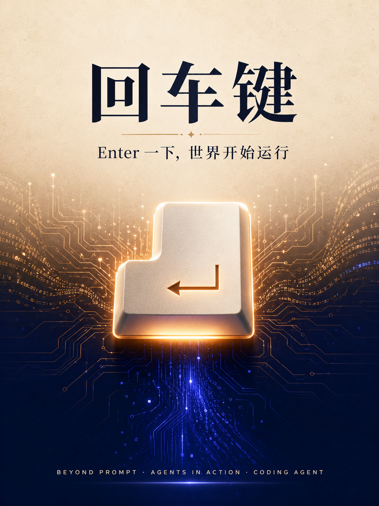

# 回车键 · 黑客松作战中心

  

> **Enter 一下，世界开始运行**
> Beyond Prompt: Agents in Action 黑客松 · 北京站 · 微软大厦二号楼

队名 **回车键** · 3 人小队 · **Coding Agent** 赛道 · 48H 极限开发。

本目录是这支队伍的「作战中心」：现场速查资料 + 团队物料。所有页面均为单文件 HTML，浏览器双击即开，离线可用。

---

## 📁 目录内容

| 文件 | 用途 | 怎么用 |
|---|---|---|
| `手册速查.html` | 选手手册速查（赛程/必交清单/赛道/评审/福利红线） | 带倒计时 + 提交清单可勾选（状态存浏览器本地） |
| `评分规则.html` | 评分五维权重 + 双轨奖项机制 + 三人队作战策略 | 对照查漏，明确该往哪投资源 |
| `主办方.html` | 主办方「小宿科技」公司速查（定位/数字/产品/打法启示） | 了解主办方能力，顺着它打选题 |
| `API资源.html` | 主办方 Search / Agent API 接入速查 | 四步接入流程 + 两产品调用要点 |
| `选手名册.html` | 73 名参赛选手名册 | 可搜索、可按赛道/组队状态筛选（找队友/看对手） |
| `选题脑暴.html` | 选题脑暴白板（思考脉络） | 收口选题前的发散记录 |
| `选题定稿.html` | 选题定稿 | 最终拍板的题目 |
| `feishu-auth-qr.png` | 飞书读取授权二维码（一次性，已用完可删） | — |

---

## 🎯 关键信息速记

### 赛程（硬截止）
- **6/28 14:30** —— 全部提交截止（Demo 链接 / 录屏 / GitHub / PPT）
- **6/28 16:00–17:30** —— 正式路演，每队 6 min（4 讲 + 2 答）

### 必交清单（缺一不可）
1. 路演 PPT（≤7 页，可 HTML，别嵌视频）— 强烈建议
2. Demo 公网可访问链接 — **必须**
3. 完整 Demo 录屏 — **必须**
4. 说明文档 + **GitHub 链接** — **必须**

### 评分五维（权重依次递减）
**创新性 > 产品完成度 > 技术深度 > 商业价值 > Demo 表现**

→ 策略：主攻「创新性」单项 + 顺带冲综合。核心流程跑通 > 功能堆多。

### 可用资源
- **Search API**：单接口、`query/sorting/filter`，做检索/RAG 首选
- **Agent API**：`opencli` responses、持续会话流、自带 Code 能力 + 记忆/Skill
- 默认额度 $20/人，不够找工作人员追加；另有奇迹算力 Token

---

## 🎨 团队物料

### 队名 & 口号
- **队名**：回车键
- **口号**：Enter 一下，世界开始运行

### 团队海报
- 成品主视觉：[`poster.png`](./poster.png)（GPT 生成，已用作 README 顶图）
- Figma 源文件（可编辑）：https://www.figma.com/board/qMCO2hgdYGtgK1Kd3rDwA3
- 视觉：暖米→深蓝渐变 + 发光 Enter 键主视觉 + 橙色药丸口号（暖米编辑风）

---

## ⏭️ 下一步（待办）

- [x] **定选题** —— Coding Agent 方向收口到一个「创新性最高 + 48h 能跑通 + 用上 Agent API」的具体题（见 `选题定稿.html`）
- [ ] 搭 Demo 脚手架（前端 + Agent API 接入）
- [ ] 核心流程端到端跑通（完成度命门）
- [ ] 准备路演 PPT（≤7 页）+ 录屏 + GitHub README
- [ ] 路演演练 ≥2 次，卡 4 分钟

---

*本作战中心由 Claude Code 协助维护。*
